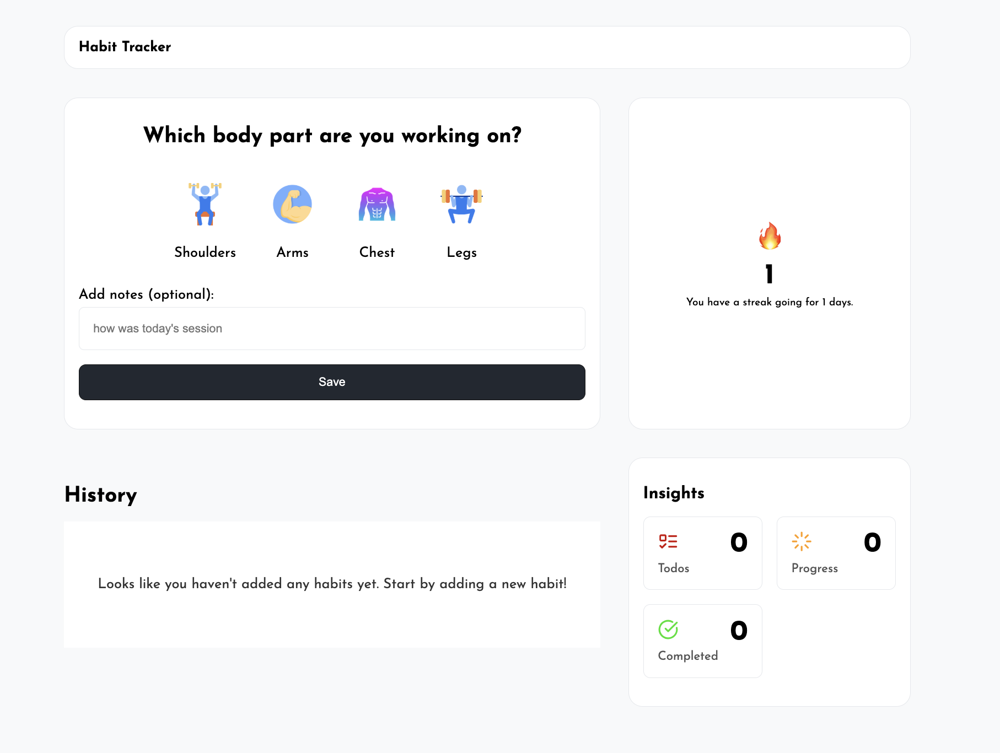

# 🔄 Habit Tracker

Track, log, and visualize your daily habits.

Live Link: [vb-habit-tracker.netlify.app/](https://vb-habit-tracker.netlify.app/)

## 📌 Table of Contents

- [🚀 Getting Started](#-getting-started)
- [🛠️ Tech Stack](#-tech-stack)
- [📦 Installing](#-installing)
- [💻 Running the Application](#-running-the-application)
- [📋 Approach](#-approach)
- [📸 Screenshots](#-screenshots)
- [🚀 Deployment](#-deployment)
- [👤 Author](#-author)

## 🚀 Getting Started

This project is built using HTML, CSS, JavaScript and Jest and hosted on Netlify.

## 🛠️ Tech Stack

- HTML
- CSS
- JavaScript
- Jest

## 📦 Installing

Clone the repository and install dependencies:

```sh
git clone https://github.com/victorbruce/habit-tracker.git
```

Install the dependencies by running the command `npm install`

And `npm test` to run the test

## 💻 Running the Application

To start the development server:

- Install the **Live Server extension**(by Ritwick Dey) in VsCode
- Right-click anywhere in the html code
- Select _Open with Live Server_ from the menu to start the development server

Or

Double click the `index.html` file to open the code in the browser of your choice.

## 📋 Approach

**Setting up Jest to work with ESM instead of CJS**

1. Install `jest` and `jest-environment-jsdom`

```sh
npm install --save-dev jest jest-environment-jsdom
```

2. In `package.json` add the following:

```json
"scripts": {
"test": "node --experimental-vm-modules node_modules/.bin/jest"
"test:watch": "node --experimental-vm-modules node_modules/.bin/jest --watch"
},
"type": "module"
```

3. Add a jest configuration file at the root of your project `jest.config.mjs` and add the following configurations:

```mjs
export default {
  testEnvironment: "jsdom",
  transform: {},
};
```

**Thought Process:**

- I designed the User interface by drawing inspiration from similar apps and sketching my ideas on paper (wireframe)

- I built separate modules for each UI component, using ES6 modules in JavaScript, and wrote tests for edge cases to simplify testing.

- I implemented the app's CRUD functionality one by one, testing each simultaneously.

- Finally, I refined the UI to enhance the UX and make it more user-friendly.

**Challenges:**

- My environment had issues reliably mocking ES module imports, so I used dependency injection instead of `jest.mock` or `jest.spyOn`. This approach made testing easier and more predictable by allowing me to pass mock functions directly into components.

## 📸 Screenshots




## 🚀 Deployment

Netlify

## 👤 Author

Victor Bruce
